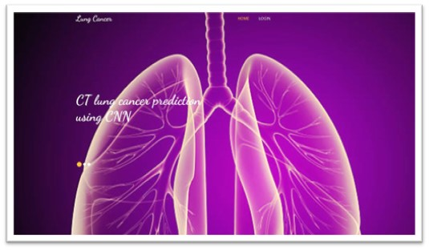
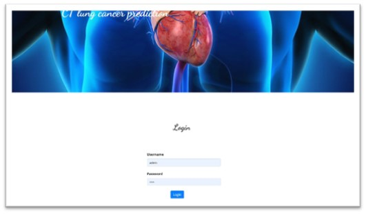
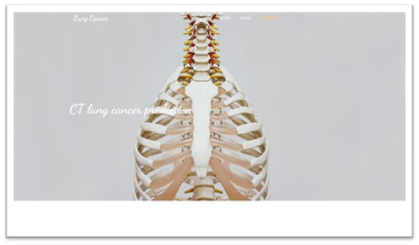
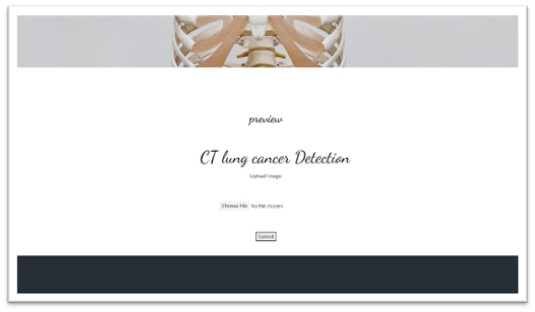
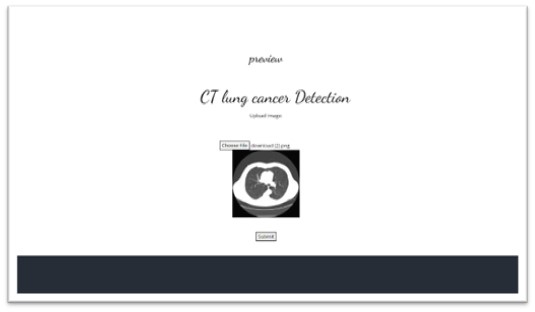
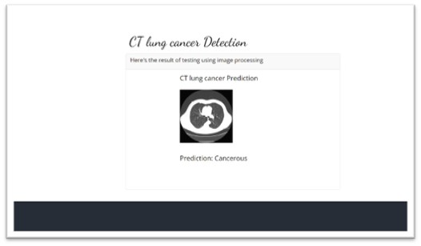
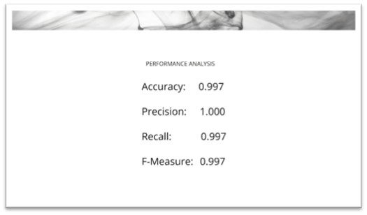
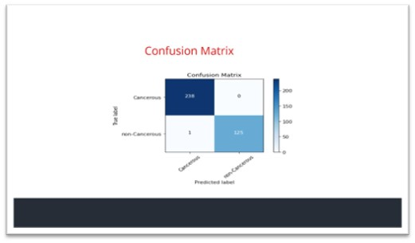
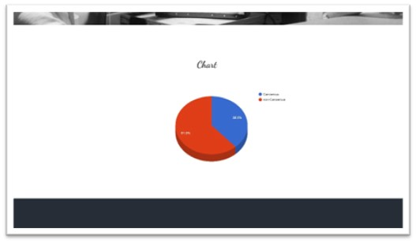

# Final Year Project for B.E. CSE 2022-2023
Academic Project for 7th and 8th semesters


Description
------------

Lung cancer is one of the most lethal cancer types; thousands of peoples are infected with this type of cancer, and if they do not discover it in the early stages of the disease, then the chance of surviving of the patient will be very poor. For the suggested reasons above and to help in overcoming this terrible, early diagnosis with the assistance of artificial intelligence procedures most needed. Also, it is one of the most common and contributing to deaths among all the cancers. Cases of lung cancer are increasing rapidly. 

There are about 70,000 cases per year in India. Over the past decade, Cancer detection using deep learning models has been a hot topic, especially in medical image classification. It is worth remarking that CNN models are more advanced at addressing diagnose diseases such as lung cancers because of the higher performance and ability of the CNN. This system presents an approach which utilizes a Convolutional Neural Network (CNN) to classify the tumours found in lung as malignant or benign. The proposed model is expected to give better accuracy than existing systems.


Notes
-----

Login Credentials <br>
Username: admin <br>
Password: admin <br>

### Requirements:
Python 3.8.10 64-bit
Visual C++ (Download x64 version "vc_redist.x64.exe") --> [Link](https://support.microsoft.com/en-us/topic/the-latest-supported-visual-c-downloads-2647da03-1eea-4433-9aff-95f26a218cc0)
Pip
  
Install Python Libraries as follows:
```python -m pip install tensorflow==2.4.0
python -m pip install numpy==1.19.5
python -m pip install keras==2.4.0
python -m pip install flask==2.2.3
python -m pip install pandas==1.1.5
python -m pip install pillow==9.5.0
python -m pip install gevent==22.10.2
```


Snapshots
---------

|  |  |  |
| :--------------------------------------: | :--------------------------------------: | :--------------------------------------: |
|  |  |  |
|  |  |  |
